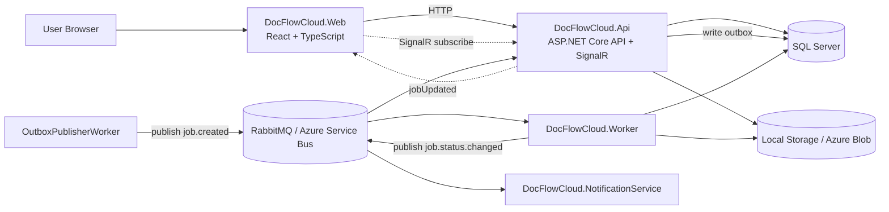
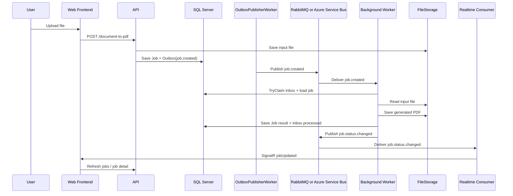
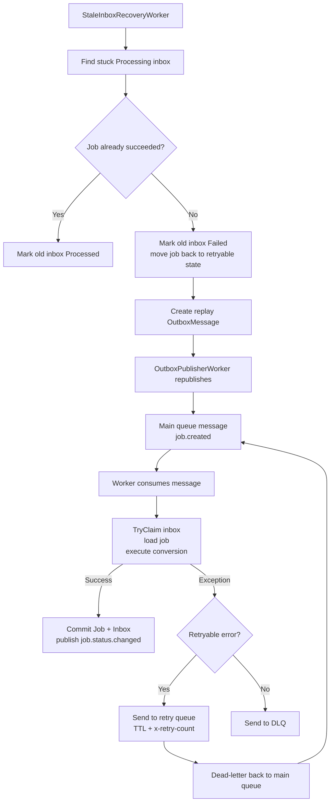

# DocFlowCloud

DocFlowCloud is a portfolio-style asynchronous document-to-PDF system built to demonstrate a realistic enterprise application flow:

- ASP.NET Core API
- React + TypeScript frontend
- environment-specific messaging:
  - local development uses RabbitMQ
  - cloud testbed uses Azure Service Bus
- Outbox / Inbox reliability patterns
- Retry / DLQ / Backoff
- Stale-processing recovery
- SignalR realtime updates
- Local file storage in development and Azure Blob in cloud testbed
- Multi-environment local setup for `Development` and `Testbed`

## What It Does

1. User uploads one or more files
2. API creates async conversion jobs
3. Worker converts files to PDF in the background
4. Frontend tracks status and allows download / retry

Supported inputs:

- images: `jpg`, `jpeg`, `png`, `bmp`, `gif`, `webp`
- text: `txt`
- markdown: `md`
- html: `html`, `htm`

## Main Components

- `src/DocFlowCloud.Web`
  - React frontend, upload / list / detail pages, SignalR client
- `src/DocFlowCloud.Api`
  - HTTP API, SignalR hub, realtime update consumer
- `src/DocFlowCloud.Worker`
  - main background processor, retry / DLQ / stale recovery
- `src/DocFlowCloud.NotificationService`
  - secondary consumer example
- `src/DocFlowCloud.Application`
  - use cases, contracts, storage abstraction
- `src/DocFlowCloud.Domain`
  - entities, state rules, outbox / inbox models
- `src/DocFlowCloud.Infrastructure`
  - EF Core, RabbitMQ / Service Bus providers, local storage, Azure Blob

## Architecture



## Main Flow



## Failure and Recovery



## Reliability Summary

- `Outbox`
  - API writes `Job` and `OutboxMessage(job.created)` in one transaction
- `Inbox`
  - consumer-side idempotency, claiming and stale detection
- `TryClaim`
  - only one worker instance can process the same message
- `Retry / Backoff`
  - retry queue + TTL + dead-letter back to main queue
- `DLQ`
  - non-retryable or exhausted messages end here
- `Stale recovery`
  - stuck `Processing` inbox entries are recovered and replayed

## Realtime Updates

SignalR is used for browser updates:

1. Worker publishes `job.status.changed`
2. API consumes it
3. API pushes `jobUpdated`
4. Frontend refreshes affected queries

## File Storage

The database stores logical file keys, not file contents.

- Development provider: `Local`
- Testbed provider: `AzureBlob`

Important keys:

- `InputStorageKey`
- `OutputStorageKey`

## Environments

Supported environment names:

- `Development`
- `Testbed`
- `Production`

Current intended usage:

- local IDE debugging: `Development`
- local Docker Compose dev stack: `Development`
- local Docker Compose testbed simulation: `Testbed`
- cloud pre-production: `Testbed`
- cloud production: `Production`

## Docker Compose

Files:

- `docker-compose.yml`
  - shared base services
- `docker-compose.dev.yml`
  - local `Development` overrides
- `docker-compose.testbed.yml`
  - local `Testbed` overrides

One-off containers:

- `migrator`
  - applies database migrations
- `rabbitmq-init`
  - creates local RabbitMQ virtual hosts and permissions

## Cloud Testbed

Current testbed deployment runs on Azure and includes:

- Azure Container Apps:
  - `web`
  - `api`
  - `worker`
  - `notification-service`
- Azure SQL Database
- Azure Blob Storage
- Azure Service Bus
- Key Vault-backed runtime secrets
- GitHub Actions + GHCR + Azure deployment flow

## Local Run

### Option A: Day-to-day development

Run infrastructure in Docker, run app code from IDE / terminal.

```powershell
docker compose up -d sqlserver rabbitmq
dotnet run --project src/DocFlowCloud.Api
dotnet run --project src/DocFlowCloud.Worker
dotnet run --project src/DocFlowCloud.NotificationService
cd src/DocFlowCloud.Web
npm install
npm run dev
```

### Option B: Local Development stack

```powershell
docker compose -f docker-compose.yml -f docker-compose.dev.yml up --build -d
```

Expected banner values:

- Frontend: `development`
- API: `Development`
- RabbitMQ vhost: `/docflow-dev`
- Database: `DocFlowCloudDevDb`

### Option C: Local Testbed simulation

```powershell
docker compose -f docker-compose.yml -f docker-compose.testbed.yml up --build -d
```

Expected banner values:

- Frontend: `testbed`
- API: `Testbed`
- Messaging: `ServiceBus`
- Database: `DocFlowCloudTestbedDb`

## Important Entry Points

Backend:

- `src/DocFlowCloud.Application/Jobs/JobService.cs`
- `src/DocFlowCloud.Worker/ServiceBusWorker.cs`
- `src/DocFlowCloud.Worker/OutboxPublisherWorker.cs`
- `src/DocFlowCloud.Worker/StaleInboxRecoveryWorker.cs`
- `src/DocFlowCloud.Worker/JobSideEffectExecutor.cs`
- `src/DocFlowCloud.Api/Realtime/ServiceBusJobStatusUpdatesConsumer.cs`
- `src/DocFlowCloud.Domain/Jobs/Job.cs`
- `src/DocFlowCloud.Domain/Inbox/InboxMessage.cs`

Frontend:

- `src/DocFlowCloud.Web/src/pages/CreateJobPage.tsx`
- `src/DocFlowCloud.Web/src/pages/JobsPage.tsx`
- `src/DocFlowCloud.Web/src/pages/JobDetailPage.tsx`
- `src/DocFlowCloud.Web/src/lib/api.ts`
- `src/DocFlowCloud.Web/src/lib/signalr.ts`
- `src/DocFlowCloud.Web/src/components/Layout.tsx`

Environment / deployment:

- `src/DocFlowCloud.Api/appsettings.*.json`
- `src/DocFlowCloud.Worker/appsettings.*.json`
- `src/DocFlowCloud.NotificationService/appsettings.*.json`
- `docker-compose.yml`
- `docker-compose.dev.yml`
- `docker-compose.testbed.yml`

## Next Steps

- Production environment
- Terraform for infrastructure
- observability improvements
