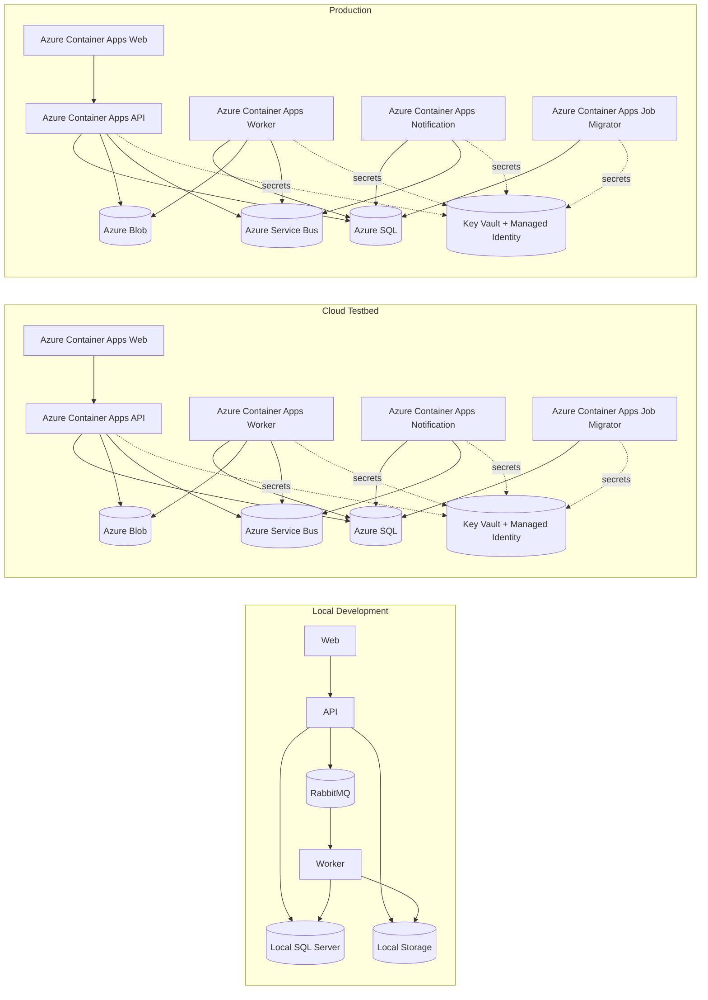

# DocFlowCloud

DocFlowCloud is a portfolio-style asynchronous document-to-PDF system built to demonstrate a realistic full-stack application with cloud delivery:

- React + TypeScript frontend
- ASP.NET Core API and background workers
- local RabbitMQ development flow
- cloud Azure Service Bus flow
- Outbox / Inbox reliability patterns
- SignalR realtime updates
- Azure SQL, Blob, Key Vault, and Container Apps
- GitHub Actions + GHCR promotion pipeline

## What It Does

1. Upload one or more files
2. Create async conversion jobs
3. Convert files to PDF in the background
4. Push job status updates back to the browser
5. Download the final PDF result

Supported inputs:

- images: `jpg`, `jpeg`, `png`, `bmp`, `gif`, `webp`
- text: `txt`
- markdown: `md`
- html: `html`, `htm`

## One-Page Architecture



## Promotion Flow

```mermaid
flowchart LR
    Dev[Push to test branch] --> CI[GitHub Actions CI]
    CI --> Build[Build and push images to GHCR]
    Build --> Testbed[Testbed deploy]
    Testbed --> Validate[Validate testbed runtime]
    Validate --> Promote[Manual production promote by image tag]
    Promote --> Migrator[Run prod migrator only if migrations changed]
    Migrator --> ProdDeploy[Update prod web, api, worker, notification]
    ProdDeploy --> Rollback[Rollback by promoting an older validated tag]
```



## Main Components

- `src/DocFlowCloud.Web`
  - React frontend, upload flow, jobs list, job detail, SignalR client
- `src/DocFlowCloud.Api`
  - HTTP API, SignalR hub, realtime status consumer
- `src/DocFlowCloud.Worker`
  - main background processor, retry / DLQ / stale recovery
- `src/DocFlowCloud.NotificationService`
  - secondary consumer example
- `src/DocFlowCloud.Application`
  - use cases, contracts, abstractions
- `src/DocFlowCloud.Domain`
  - entities, state rules, inbox / outbox models
- `src/DocFlowCloud.Infrastructure`
  - EF Core, RabbitMQ / Service Bus providers, local storage, Azure Blob

## Environments

- `Development`
  - local Docker / IDE workflow
  - RabbitMQ
  - local file storage
- `Testbed`
  - Azure cloud pre-production
  - Azure Service Bus
  - Azure Blob
  - Key Vault + managed identity
- `Production`
  - Azure cloud production
  - promote validated image tags
  - same runtime shape as testbed

## Local Run

### Option A: day-to-day development

```powershell
docker compose up -d sqlserver rabbitmq
dotnet run --project src/DocFlowCloud.Api
dotnet run --project src/DocFlowCloud.Worker
dotnet run --project src/DocFlowCloud.NotificationService
cd src/DocFlowCloud.Web
npm install
npm run dev
```

### Option B: full local development stack

```powershell
docker compose -f docker-compose.yml -f docker-compose.dev.yml up --build -d
```

### Option C: local testbed simulation

```powershell
docker compose -f docker-compose.yml -f docker-compose.testbed.yml up --build -d
```

## Docs

- [Architecture](docs/architecture.md)
- [System Flow](docs/system-flow.md)
- [Release Runbook](docs/release-runbook.md)

## Next Steps

- Terraform for infrastructure
- observability / dashboards / alerts
- sharper release runbook and incident troubleshooting
