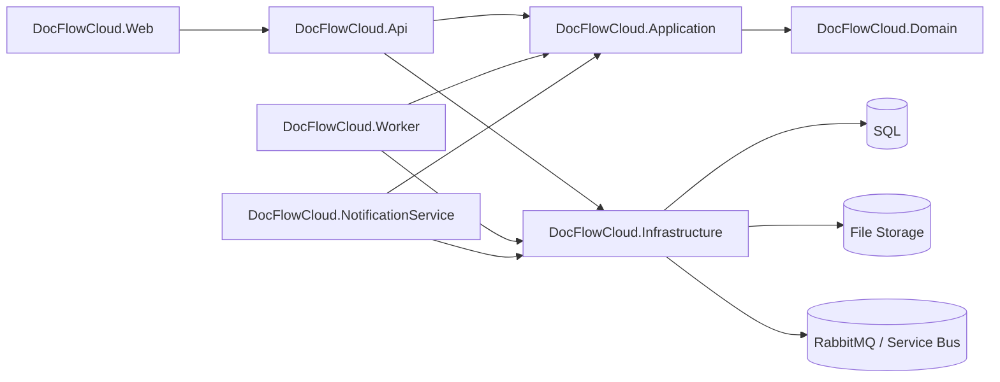

# Architecture

`DocFlowCloud` is an asynchronous document-to-PDF system designed to demonstrate a realistic application architecture across local development, cloud testbed, and production.

## High-Level Shape

## Layers

### `DocFlowCloud.Web`

Responsibilities:

- upload files
- create jobs
- display job list and detail
- subscribe to SignalR updates
- download the generated PDF

### `DocFlowCloud.Api`

Responsibilities:

- receive uploaded files
- create conversion jobs
- expose job query and result download endpoints
- host the SignalR hub
- expose health checks
- consume realtime status updates in cloud environments

Key files:

- `src/DocFlowCloud.Api/Program.cs`
- `src/DocFlowCloud.Api/Controllers/JobsController.cs`
- `src/DocFlowCloud.Api/Realtime/ServiceBusJobStatusUpdatesConsumer.cs`

### `DocFlowCloud.Application`

Responsibilities:

- define use cases and orchestration rules
- define integration messages and contracts
- expose abstractions for storage, messaging, metrics, and tracing
- depend on abstractions instead of providers

Key files:

- `src/DocFlowCloud.Application/Jobs/JobService.cs`
- `src/DocFlowCloud.Application/Abstractions/Observability/IJobMetrics.cs`
- `src/DocFlowCloud.Application/Abstractions/Observability/DocFlowCloudTracing.cs`

### `DocFlowCloud.Domain`

Responsibilities:

- define `Job`
- define `InboxMessage`
- define `OutboxMessage`
- enforce state transitions

Core concepts:

- `JobStatus`
- retry rules
- inbox claim / processing state
- outbox persistence before publish

### `DocFlowCloud.Infrastructure`

Responsibilities:

- EF Core persistence
- local / Azure Blob storage implementations
- RabbitMQ / Azure Service Bus implementations
- metrics implementation
- dependency injection and provider switching

Design note:

- local `Development` keeps RabbitMQ and local storage
- cloud `Testbed` / `Production` switch to Service Bus and Azure Blob

Key files:

- `src/DocFlowCloud.Infrastructure/DependencyInjection.cs`
- `src/DocFlowCloud.Infrastructure/Messaging/ServiceBusJobMessagePublisher.cs`
- `src/DocFlowCloud.Infrastructure/Storage/AzureBlobFileStorage.cs`
- `src/DocFlowCloud.Infrastructure/Observability/JobMetrics.cs`

### `DocFlowCloud.Worker`

Responsibilities:

- publish outbox messages
- consume job messages
- execute document conversion
- update job state and result storage
- recover stale processing

Key files:

- `src/DocFlowCloud.Worker/OutboxPublisherWorker.cs`
- `src/DocFlowCloud.Worker/ServiceBusWorker.cs`
- `src/DocFlowCloud.Worker/JobSideEffectExecutor.cs`
- `src/DocFlowCloud.Worker/StaleInboxRecoveryWorker.cs`

### `DocFlowCloud.NotificationService`

Responsibilities:

- subscribe to job events
- run secondary consumer logic
- maintain its own inbox processing state

Key files:

- `src/DocFlowCloud.NotificationService/ServiceBusNotificationWorker.cs`

## Data and Storage

### Database

Primary tables:

- `Jobs`
- `InboxMessages`
- `OutboxMessages`

### File storage

The database stores logical storage keys rather than file contents.

- development: local file storage
- cloud: Azure Blob Storage

Important keys:

- `InputStorageKey`
- `OutputStorageKey`

## Messaging Model

### Local development

- RabbitMQ

### Cloud testbed and production

- Azure Service Bus topic: `job-events`
- subscriptions:
  - `worker`
  - `notification`
  - `api-realtime`

## Reliability Patterns

- Outbox
  - API writes `Job` and `OutboxMessage` in one transaction
- Inbox
  - consumer-side idempotency and claim tracking
- Retry / DLQ
  - transient failures are retried; terminal failures land in dead-letter handling
- Stale recovery
  - long-running stuck processing states can be replayed safely

## Observability Baseline

- structured Serilog logs for cloud environments
- key job lifecycle logs:
  - created
  - succeeded
  - failed
  - retried
- API health endpoints:
  - `/health`
  - `/health/live`
  - `/health/ready`
- metrics instrumentation for job throughput, failures, retries, and duration
- minimal OpenTelemetry tracing baseline for API, worker, and notification processing

## Cloud Runtime Model

### Testbed

- Azure Container Apps:
  - `web`
  - `api`
  - `worker`
  - `notification-service`
- Azure Container Apps Job:
  - `migrator`
- Azure SQL Database
- Azure Blob Storage
- Azure Service Bus
- Azure Key Vault
- managed identities

### Production

- same runtime shape as testbed
- validated image tags are promoted from testbed
- runtime secrets come from Key Vault through managed identity
- infrastructure shape is defined through Terraform

## Infrastructure Status

- `testbed` has been imported into Terraform state and aligned to zero drift
- `prod` is modeled in Terraform as a clean create-from-scratch environment
- Terraform manages resource shape and runtime baseline configuration
- CI/CD manages image build, push, and deployment version updates
