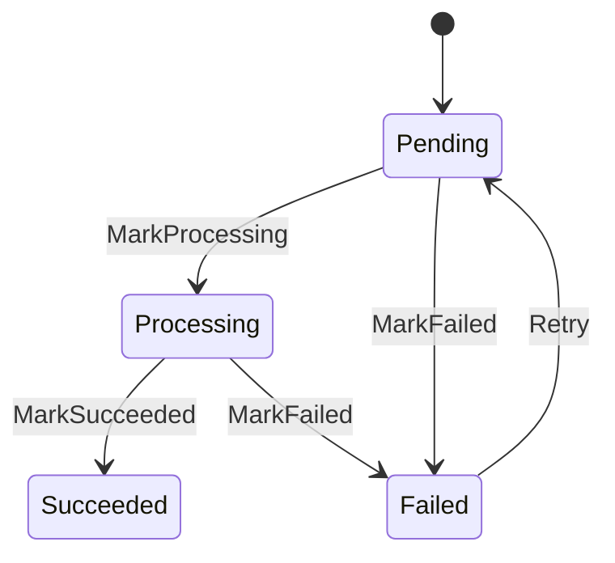
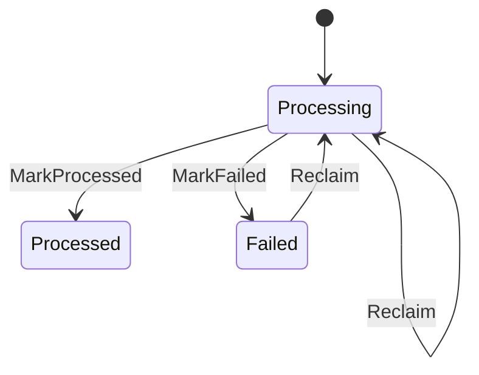

# 状态图

这份文档展示当前 `Job` 和 `InboxMessage` 的状态流转。

## Job 状态图

## Job 状态含义

- `Pending`：任务已经创建，但还没有完成处理。
- `Processing`：某个 worker 正在处理这个任务。
- `Succeeded`：任务处理成功。
- `Failed`：任务处理失败，可以进入重试。

## Inbox 状态图

## Inbox 状态含义

- `Processing`：某个消费者已经 claim 了这条消息，当前负责处理它。
- `Processed`：该消费者已经成功处理完这条消息。
- `Failed`：该消费者处理失败，后续可以重试或接管。

## 为什么 Job 和 Inbox 要分开

- `Job` 记录的是业务状态。
- `InboxMessage` 记录的是消息消费状态。
- 一个业务对象在生命周期里可能会对应多条消息。
- Claim、重试、去重、超时接管这些语义，不应该直接塞进业务实体本身。
