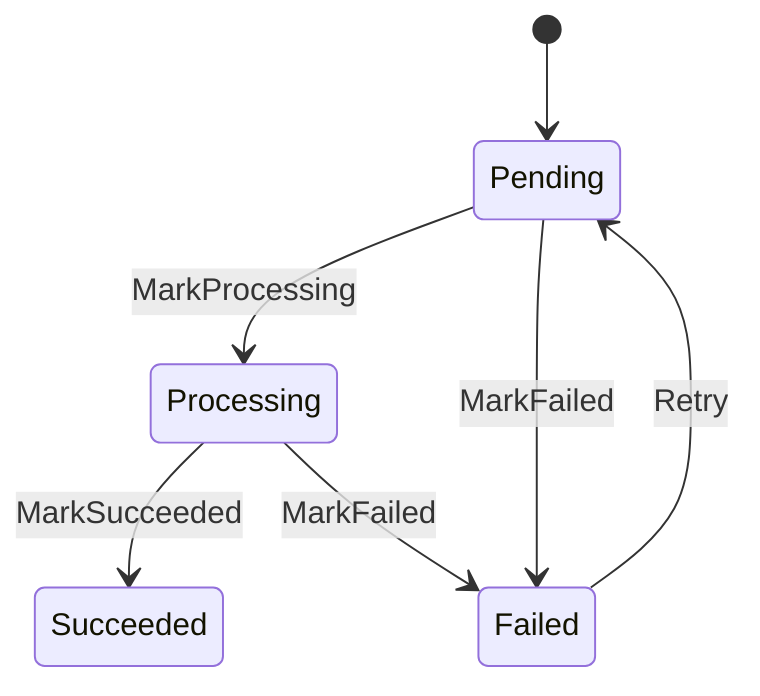
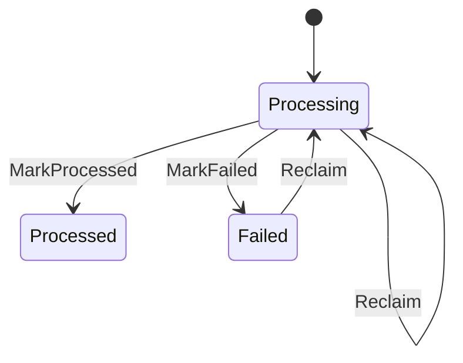

# State Diagrams

This document shows the current state flow for `Job` and `InboxMessage`.

## Job State Diagram

## Job State Meaning

- `Pending`
  - the job has been created but not completed yet
- `Processing`
  - a worker has claimed the job and is processing it
- `Succeeded`
  - the document has been converted successfully
- `Failed`
  - processing failed; the job may later be retried

## Inbox State Diagram

## Inbox State Meaning

- `Processing`
  - a consumer has claimed the message and is currently handling it
- `Processed`
  - the consumer completed handling successfully
- `Failed`
  - the consumer failed; the message may later be reclaimed or retried

## Why `Job` And `InboxMessage` Are Separate

- `Job` tracks business state
- `InboxMessage` tracks consumer-side message processing state
- one business object may correspond to multiple consumed messages during its lifetime
- claim, deduplication, stale recovery, and replay semantics do not belong directly inside the business entity itself
