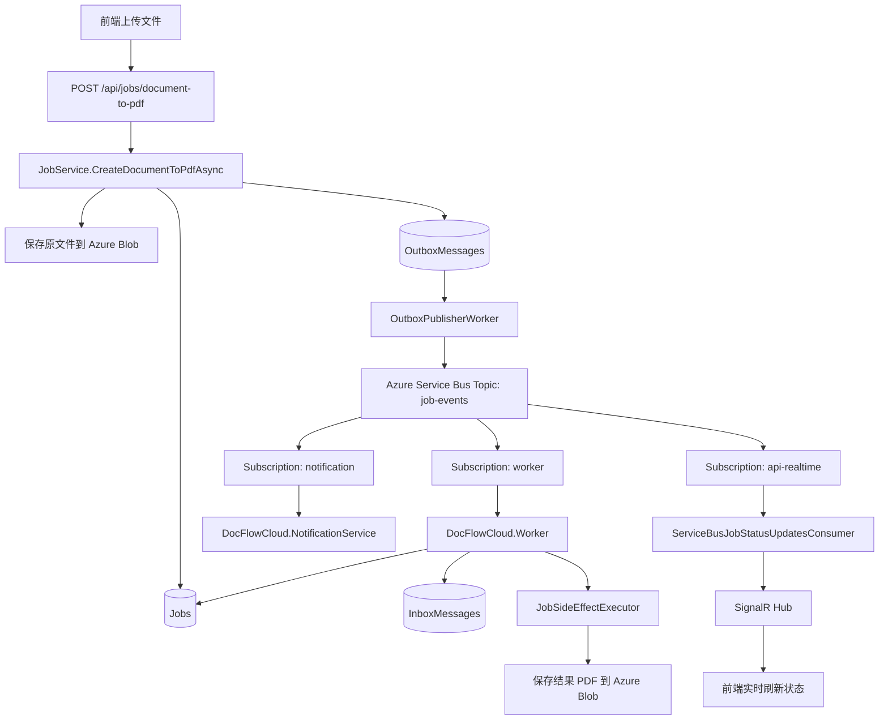
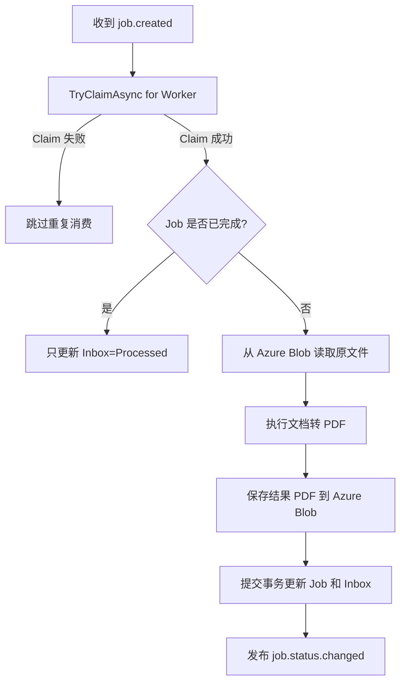
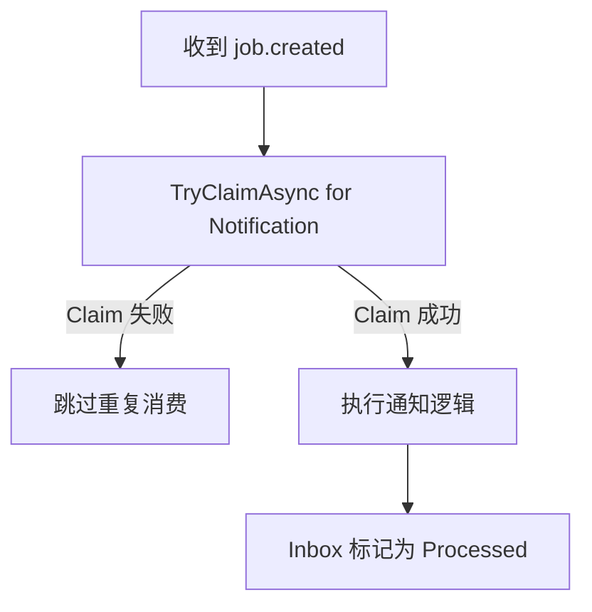
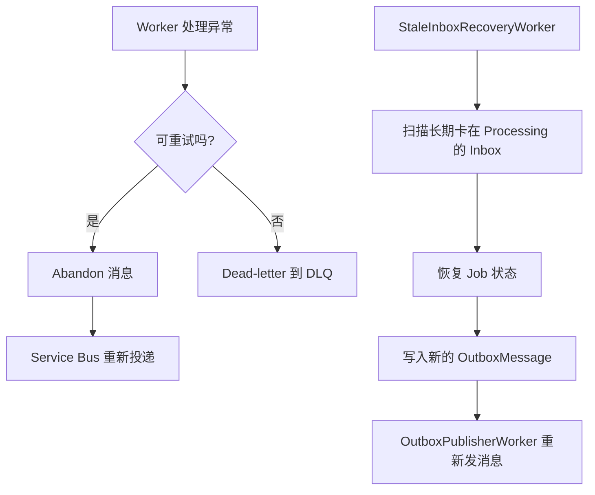

# 系统流程图

这份文档描述当前 `DocFlowCloud` 在两种环境下的真实消息链：

- **本地 Development**：继续使用 RabbitMQ，方便调试和断点
- **云上 Testbed**：使用 Azure Service Bus，走真实云消息基础设施

## 当前云上主链

## 从上传到处理完成

1. 前端上传一个图片、txt、md 或 html 文件。
2. API 调用 `JobService.CreateDocumentToPdfAsync(...)`。
3. `JobService` 先把原文件写入存储层，拿到 `InputStorageKey`。
4. `JobService` 在同一个数据库事务里写入：
   - 一条 `Job`
   - 一条 `OutboxMessage`
5. `OutboxPublisherWorker` 扫描未发布 Outbox，把 `job.created` 发到 Azure Service Bus Topic `job-events`。
6. `worker` subscription 被 `DocFlowCloud.Worker` 消费。
7. `notification` subscription 被 `DocFlowCloud.NotificationService` 消费。
8. Worker 从 Azure Blob 读取原文件，执行文档转 PDF。
9. Worker 把生成好的 PDF 保存回 Azure Blob，并更新数据库中的 `Job` / `InboxMessage`。
10. Worker 发布 `job.status.changed` 到同一个 Topic。
11. `api-realtime` subscription 被 API 里的 `ServiceBusJobStatusUpdatesConsumer` 消费。
12. API 通过 SignalR 把 `jobUpdated` 推给前端，前端实时更新状态。

## Worker 消费流程

## Notification Service 流程

## 失败与恢复

## 环境差异

### 本地 Development

- SQL Server：本地 Docker
- 消息系统：RabbitMQ
- 文件存储：Local
- 目的：快速调试、断点、低成本开发

### 云上 Testbed

- Azure SQL Database
- Azure Service Bus
- Azure Blob Storage
- Azure Container Apps
- 目的：验证完整云上交付链和真实运行环境
