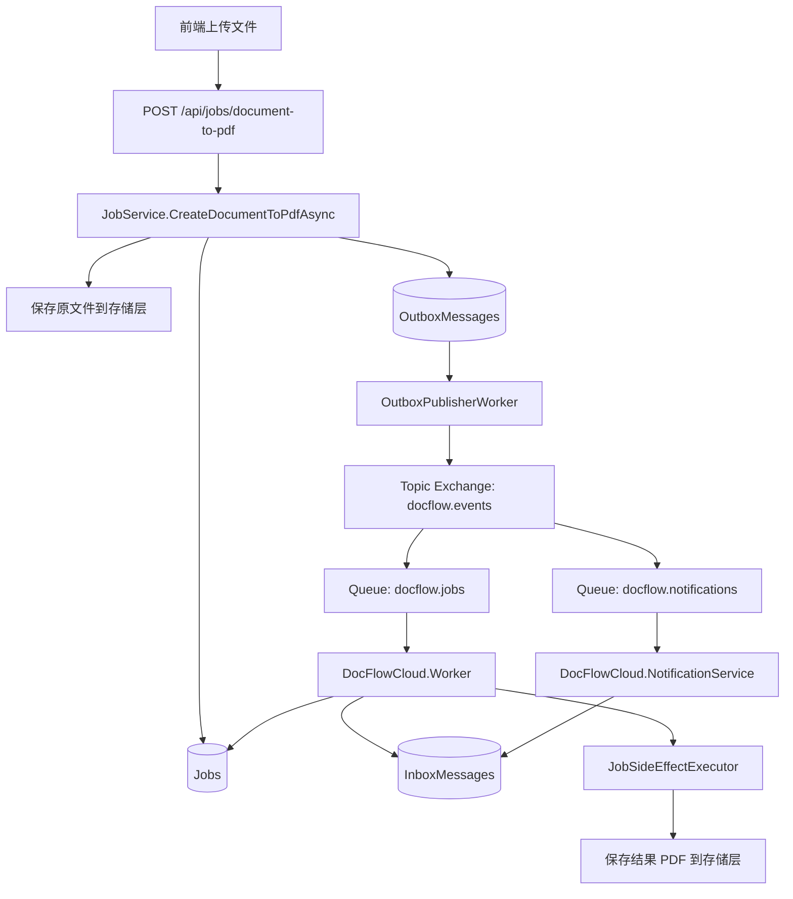
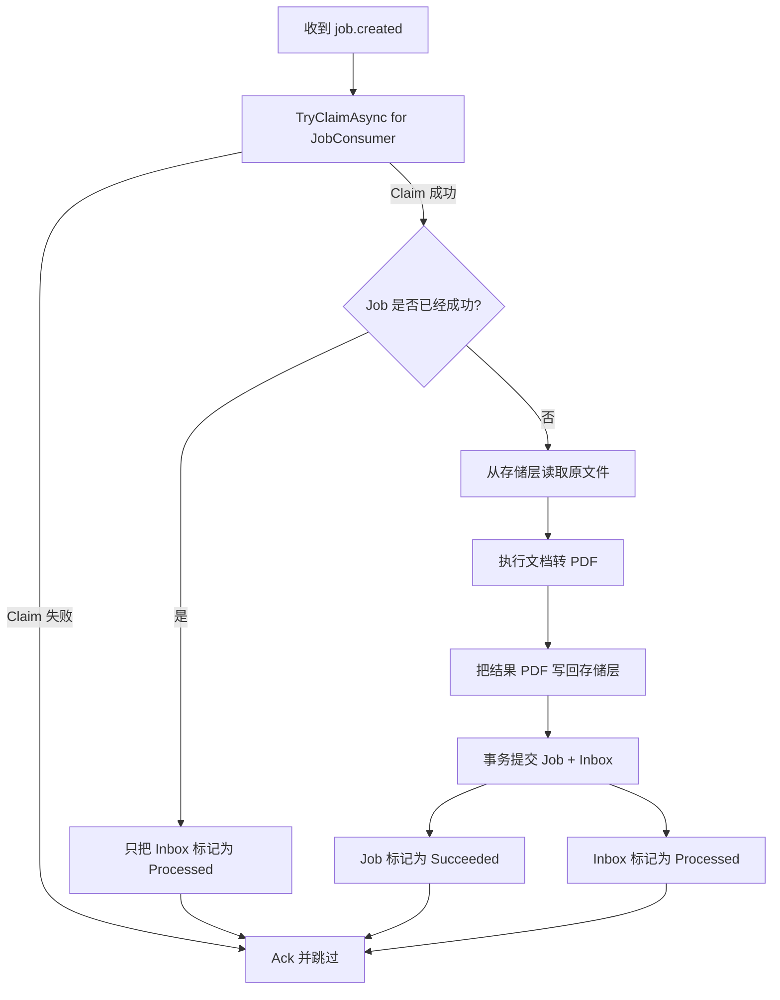
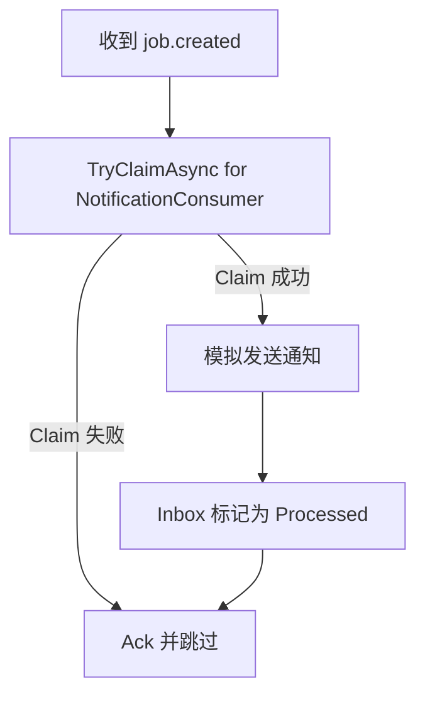
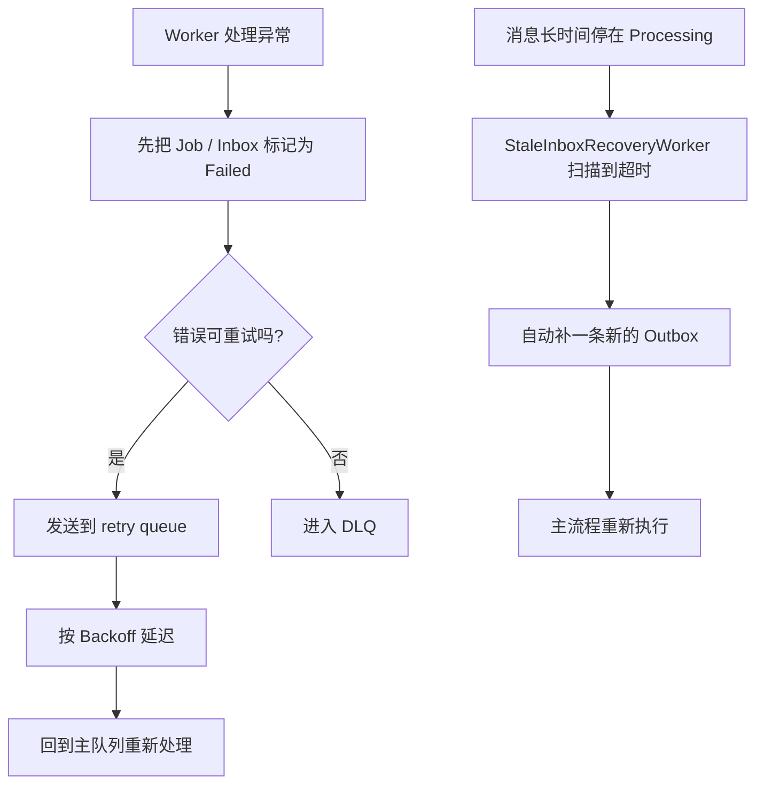

# 系统流程图

这份文档说明当前 DocFlowCloud 中，一个“上传文档并异步转 PDF”的请求是如何流转的。

## 主流程

## 从上传到处理完成

1. 前端上传一个图片、txt、md 或 html 文件。
2. API 接收文件并调用 `JobService.CreateDocumentToPdfAsync(...)`。
3. `JobService` 先把原文件保存到存储层，拿到 `InputStorageKey`。
4. `JobService` 在同一个数据库提交里写入：
   - 一条 `Job`
   - 一条 `OutboxMessage`
5. `OutboxPublisherWorker` 扫描到未处理 Outbox，发布 `job.created`。
6. RabbitMQ 把同一个事件分发到：
   - `docflow.jobs`
   - `docflow.notifications`
7. `DocFlowCloud.Worker` 消费任务处理队列。
8. `DocFlowCloud.NotificationService` 消费通知队列。
9. `DocFlowCloud.Worker` 从存储层读取原文件，执行文档转 PDF。
10. Worker 把生成好的 PDF 保存回存储层，拿到 `OutputStorageKey`。
11. Worker 事务化提交：
   - `Job = Succeeded`
   - `Inbox = Processed`
12. 前端轮询任务状态，成功后下载 PDF。

## Job Worker 消费流程

## Notification Service 流程

## 失败与恢复流程

## CorrelationId 链路

1. API 从请求头读取或生成 `X-Correlation-Id`
2. 写入响应头和日志上下文
3. `JobService` 把同一个 `CorrelationId` 写入消息
4. Worker 消费消息时恢复这个 `CorrelationId`
5. 最终你可以用同一个编号串起：
   - API 日志
   - Outbox 发布
   - Job Worker 日志
   - Notification Service 日志
