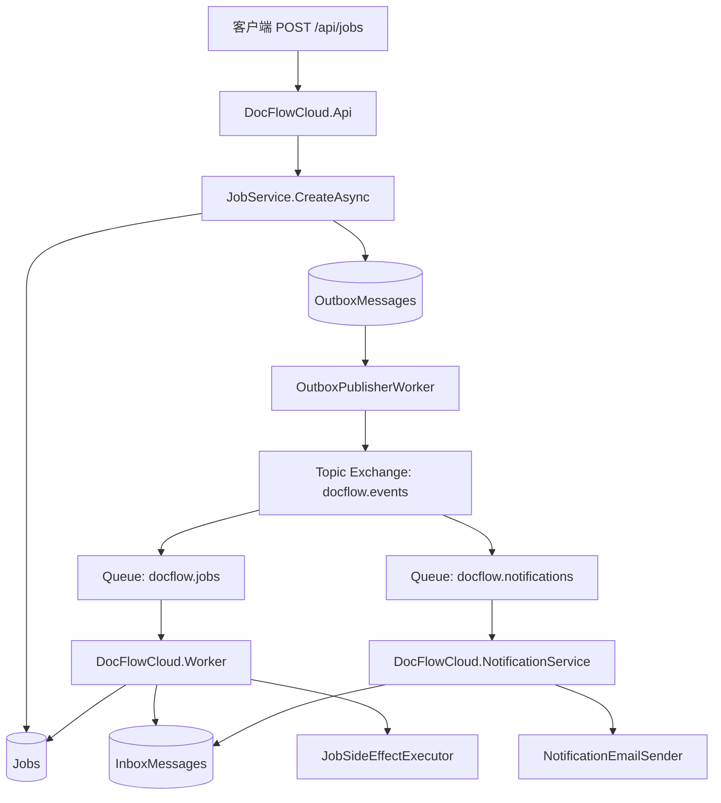
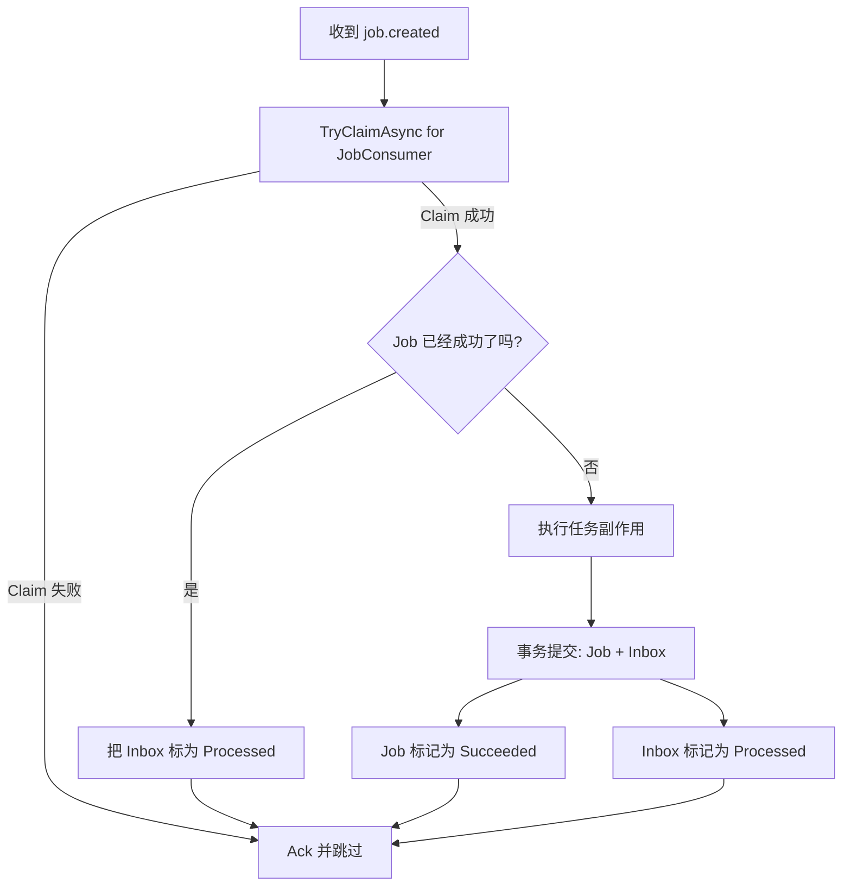
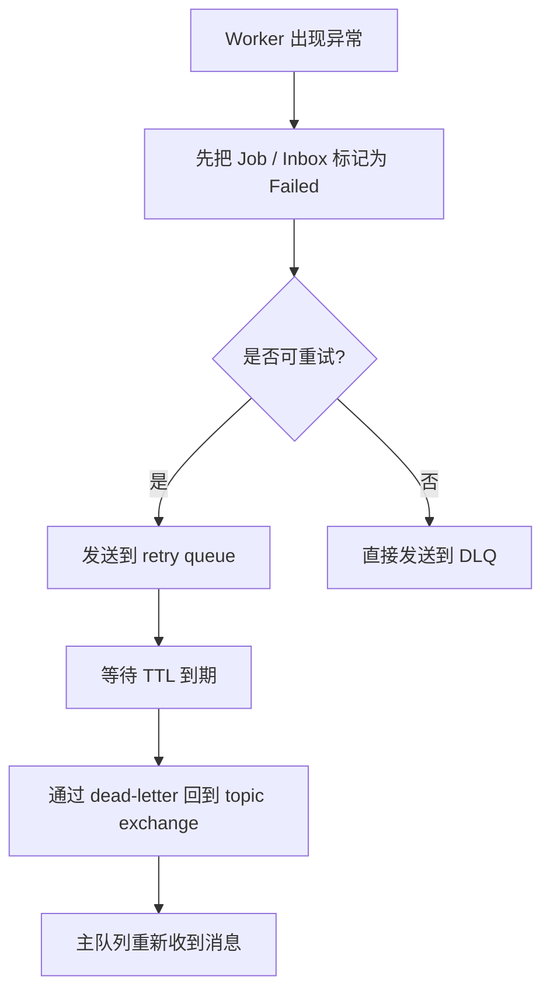

# 系统流程图

这份文档说明当前 DocFlowCloud 中，一个请求是如何流转到消息、消费者和数据库状态更新的。

## 主流程

## 从请求到处理完成

1. 客户端调用 `POST /api/jobs`。
2. `JobService` 在同一个数据库事务里写入：
   - 一条 `Job`
   - 一条 `OutboxMessage`
3. `OutboxPublisherWorker` 扫描未处理的 outbox 记录。
4. 发布器把 `job.created` 事件发送到 `docflow.events` 这个 topic exchange。
5. RabbitMQ 把同一个事件路由到两个队列：
   - `docflow.jobs`
   - `docflow.notifications`
6. `DocFlowCloud.Worker` 消费任务处理队列。
7. `DocFlowCloud.NotificationService` 消费通知队列，模拟发送邮件。

## 任务处理 Worker 流程

## 通知服务流程

## 失败与重试流程

## CorrelationId 链路

1. API 读取或生成 `X-Correlation-Id`。
2. 该值会写入响应头和 Serilog 日志上下文。
3. `JobService` 把相同的 `CorrelationId` 写入消息体。
4. Worker 消费消息时，再把这个值恢复到自己的日志上下文。
5. 后续排查时，可以通过同一个 `CorrelationId` 串起 API 和两个消费者的日志。
